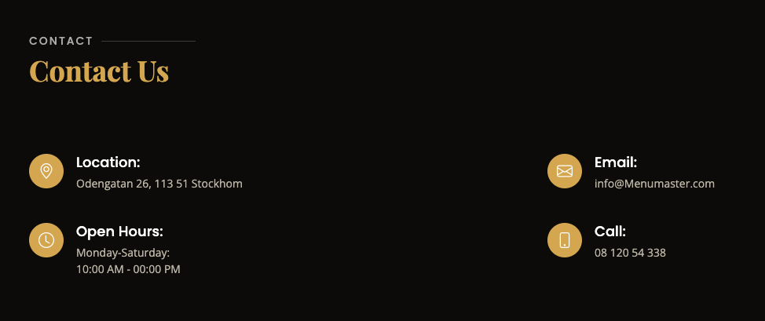

Welcome to Menumaster

##### This is the fourth project under the Code Institute Diploma in Software Development (E-commerce Applications) program. This website is a fictional webbsite called Menumaster. It is designed to be responsive and accessible on a variety of devices for the ease of use of the site by potential costumers.

##### The website, Menumaster, is designed for a restaurant located in Stockholm City. It caters to customers who are seeking a delightful dining experience and a place to relax in Stockholm City. The restaurant offers a delectable menu with a touch of magic in its atmosphere. The website provides account registration and booking functionality, allowing customers to conveniently manage their reservations directly through the website.

### UX (User Experience)

User stories

*First time visitor goals*

As a first time visitor, I want:
* to easily understand the main purpose of the site.
* to be able to easily navigate throughout the site.
* to be able to find information about how to make a reservation at the restaurant.
* to be able to reserve a day and time for a visit, view booking details and make changes to created bookings and delete my bookings.
* to be able to log out of my user account.

*Returning and frequent visitor goals*

As a returning user, I want:

* to sign in to my user account.
* to make a table booking.
* to view my booking details.
* to edit my booking details or delete them.
* to sign out of my account to keep my account safe.

*Site Administrator goals* 

As a Site Administrator I would like to be able to create, view, edit and delete booking data.

## Agile tools

The GitHub Projects section was used as a Kanban board for the development of this project, which made it possible to break down the project execution into subtasks and make it easier to complete and track project progress. User stories were used to break down the project into sub-tasks and placed on the Kanban board to work on them and track progress. In addition, labels were used to further define the priority of each user story in the Kanban board.

## Design and Site structure

##### The theme of the restaurans is meant to be a luxury, cozy and exclusive enviroment. With its dark, inviting colors and intimate atmosphere, it provides the perfect setting for a memorable dining experience. Impeccable service and a menu created by talented chefs guarantee a fusion of exquisite flavors that will leave a lasting impression.

*Colors*

The website features an elegant black color scheme, creating a sophisticated atmosphere. Gold accents, such as buttons, icons, and headings, add a touch of luxury and enhance the premier look and feel of the webpage.

*Fonts* 

 The fonts in the theme are clear and modern and contribute perfectly to the overall elegant setting.

 *Images* 

 The images in the theme provide great content and presentation of the restaurant and serves as an enticement for the visitors.

 ## Features 

*NAVBAR*

* The navbar prominently displays all the available sections for the user to explore, ensuring effortless navigation throughout the site. It serves as a convenient and efficient tool for users to access different areas of the website with ease.

* To enhance usability, the link for making a booking is specially emphasized by enlarging its size. This intentional design choice ensures that the booking feature stands out and is easily discoverable, providing users with a straightforward and hassle-free experience.

*Landing page*

* The hero section of the website creates a captivating first impression, showcasing the restaurant to visitors. It includes important links such as the menu and reservation options, as well as a presentation video to further market the restaurant.

*MENU*

* The menu section showcases a variety of options available at the restaurant, complete with enticing images and descriptions. It offers a convenient filtering functionality that allows users to sort options based on their preferred type of meal. This feature enhances the user experience, making it easy to explore and select from the diverse range of menu items.

*ABOUT*

* The about section of the website incorporates elements of the restaurant's design and ambiance, emphasizing its unique selling points. This section showcases the distinct aesthetic and atmosphere of the establishment, providing visitors with a glimpse into the captivating settings that set it apart. By highlighting these aspects, the about section further enhances the restaurant's appeal and reinforces its unique identity.

*Testimonials*

* The testimonials section features feedback from previous customers, offering social proof to boost customer conversion on the webpage. These testimonials showcase the experiences and opinions of satisfied patrons, building trust and credibility for the restaurant. By highlighting positive reviews, this section effectively influences potential customers, assuring them of the restaurant's quality and encouraging them to choose it with confidence.

*GALLARY* 

* The gallery section allows visitors to view stunning images showcasing the interior and overall ambiance of the restaurant. It provides a visual glimpse of the captivating aesthetics, giving potential customers a glimpse of what to expect and enticing them to visit and experience the restaurant for themselves.

*CONTACT*

* The contact section includes all the necessary information about the restaurant that the visitor may need to know about.

**ACCOUNT SINGUP/LOGIN*

* The account pages offer users the ability to create a new account for registration purposes and also provide a login option for existing users. These dedicated pages ensure a seamless user experience by allowing individuals to easily create their account and securely access their personal information. By offering this functionality, the website simplifies the registration and login process, enabling users to conveniently manage their reservations and access personalized features.

*BOOKING PAGE*

* In the booking page the customer can make a reservation using the form and save it. It will then show up in the customer's mybooking page.

*MYBOOKINGS*

* The mybooking page displays the customer's current bookings, providing a comprehensive overview of each reservation, including date and time details. This allows customers to easily track and manage their bookings in one place. The page also offers the convenience of making updates to a booking by clicking the "change" button. Any modifications made will be saved and reflected on the mybooking page. Additionally, customers have the option to delete a booking by clicking the "delete" button, removing it from the list of reservations. This functionality ensures flexibility and control for customers, allowing them to easily manage their bookings according to their needs.

*DELETE BOOKING*

* When a customer clicks on the "delete" button in the mybookings page, a warning message is displayed to prevent accidental deletion of bookings. This precautionary message ensures that customers are aware of the action they are about to take, reducing the likelihood of mistakenly deleting their reservations. By providing this warning, the system helps customers make informed decisions and avoids any unintended loss of important booking information.

*FOOTER*

* The footer section of the website conveniently houses essential information about the restaurant, ensuring easy access to relevant contact details and social media links. This persistent component remains visible on all pages, allowing users to quickly locate important information regardless of their current location on the website. By placing key contact information and social media links in the footer, the website promotes seamless navigation and engagement, enabling visitors to easily connect with the restaurant through various channels.

## Technologies Used

*Languages*

* Python
* JavaScript
* HTML5
* CSS3

## Frameworks, Libraries, Programs

*Python Built-in Modules:*
* os

*External Packages*

* cloudinary
* dj-database-url
* dj3-cloudinary-storage
* Django: python framework used to create all the backend

* django-allauth
* gunicorn
* psycopg2

## Programs & Tools

* [Google Fonts](https://fonts.google.com/)
Was used to to incorporate font styles.
* [Bootstrap](https://bootstrapmade.com/)
Was used to create the front-end design.
* [Gitpod](https://www.gitpod.io/)
Gitpod was used as IDE to commit and push the project to GitHub
* [Github](https://github.com/)
Was used for all storing and backup of the code pertaining to the project.

## Testing 

The site was constantly tested during the process of creating the site in the Gitpod Environment and the deployed site on Heroku was also tested in terms of user experience. The available functionality and user experience is shown in the table below.

| Goals/actions  | As a guest | As a logged user  | Result | Comment |
|--|:--:|:--:|:--:|--|
| I can use menu and navigating through pages | &check; | &check; | Pass | Click on menu item redirects to appropriate page |
| I can see the home page | &check; | &check; | Pass | |
| I can see the Services page | &check; |&check;  |  Pass| |
| I can see the Sign Up page | &check; |&check;  |  Pass| |
| I can see the Login page  | &check; |&check;  |  Pass| |
| I can see the Logout page  | &check; |&check;  |  Pass| |
| I can click the Book a table button  | &check; |&check;  |  Pass| Redirects to the page with a message that the user must register or log in for guest or shows up form for authorized user |
| I can see the Booknow page | &cross; | &check;  | Pass |A page is displayed with a message that the user must register or log in  |
| I can fill fields in the form the make a booking page | &cross; | &check;  | Pass |This page and form are available only to authorized users |
| I can see the Bookings page   | &cross; | &check;  | Pass | This page is available only to an authorized users|
| I can see the Mangae your booking page  | &cross;  | &check;  | Pass | This page is available only to authorized users|
| I can edit booking in the form on the Change booking page  | &cross;  | &check;  | Pass |This page is available only to authorized users ||
| I can see the Delete booking page  |  &cross; | &check;  |Pass  | This page is available only to authorized users |
| |

## Deployment

The project was developed using Gitpod, the project code is stored on GitHub, and then deployed to Heroku.

To deploy, follow these steps:

1. Log in to Heroku or create an account if required. On the Welcome page in the top right corner click the button labeled 'New'.

2. From the drop-down menu select 'Create new app'. Enter a preferred app name. Select the relevant geographical region. Click to 'Create App'.

3. Navigate to 'Settings' and scroll down to the 'Config Vars' section. Click 'Reveal Config Vars' and enter 'PORT' for the key and '8000' for the value. Then click 'Add'. Add CLOUDINARY_URL, DATABASE_URL and SECRET_KEY. URL variable values ​​must be copied from your CLOUDINARY account and ElephantSQL account. To create a SECRET KEY, use the online service or come up with your own.

4. Click on the 'Deploy' tab. Next to 'Deployment method' select 'GitHub'. Connect the relevant GitHub repository. Under 'Manual deploy' choose the correct branch and click 'Deploy Branch'. Also you can select 'Automatic Deploys' so that the site updates when updates are pushed to GitHub.

5. After successful deployment message in the page top right corner click the button labeled 'Open app' and you can access live app.

### Forking the GitHub Repository

To use this code and make changes without affecting the original code, it is possible to 'fork' the code on the GitHub repository through the following steps:

1. Create or log into your GitHub account.
2. Go to the GitHub repository.
3. Click the 'Fork' button in the upper right-hand
4. corner of the page. A copy of the repository will be available in your own repository.

### Making a Local Clone
1. Go to the project [Github repositry](https://github.com/Meyaal/Dine)
2. Click on the "Code" button.
3. Choose one of the three options (HTTPS, SSH or GitHub CLI) and then click copy.
4. Open the terminal in you IDE program.
5. Type git clone and paste the URL that was copied in step 3.
6. Press Enter and the local clone will be created.

## Credits

Code 

[Restaurantly - Restaurant Website Template](https://bootstrapmade.com/restaurantly-restaurant-template/) was the Boostrap theme used in the project.

[Django Dokumnetation ](https://www.djangoproject.com/) was used to provide examples of code solutions and Django functionality.

[Bootstrap Documenation](https://getbootstrap.com/) 
was used to provide examples of Bootstrap functionality and building blocks.

[Code Institute walkthrough](https://codeinstitute.net/se/) as inspiration and code examples, the code institute walkthroughs "Hello Django" and "I Think Therefore I Blog" was used.

[MDN web docs](https://developer.mozilla.org/en-US/docs/Learn/Server-side/Django/Tutorial_local_library_website) This toturial was helpful to understand the concept af django as a framework.

[Github](https://github.com/ErikHgm/Menumaster-Restaurant-Project) I found similar project in github which i have used some codes and inspiration to build my own.

Content

* The texts that are used for testimonials comes from [Tripadvisor](https://www.tripadvisor.se/)
* The texts that are used for the about section comes from [Github](https://github.com/ErikHgm/FireHouse-Restaurant-Project).

Media

* The images in the project comes from the [Restaurantly Boostrap theme](https://getbootstrap.com/)

* The video in the project comes from the [Restaurantly Boostrap theme](https://bootstrapmade.com/restaurantly-restaurant-template/)

## Acknowledgements

The Code Institute Slack community.

The tutor support team at Code Institute for their support.

My Code Institute Mentor for feedback, inspiration and suggestions.

 

